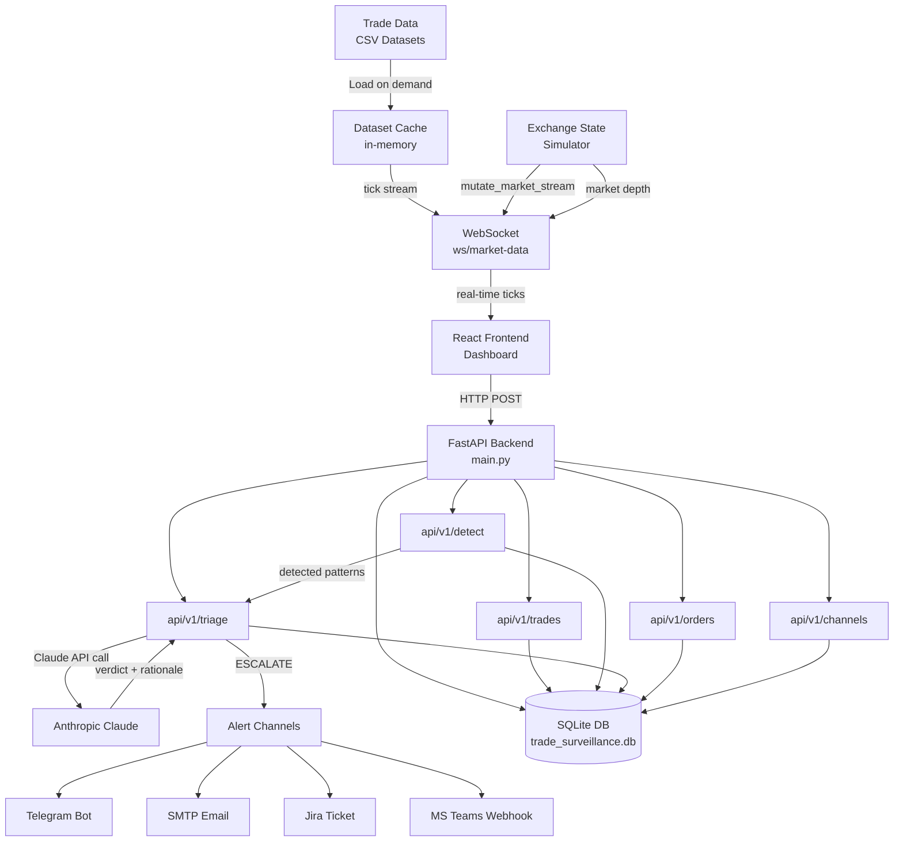
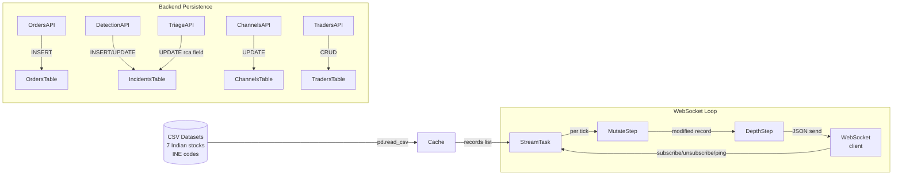
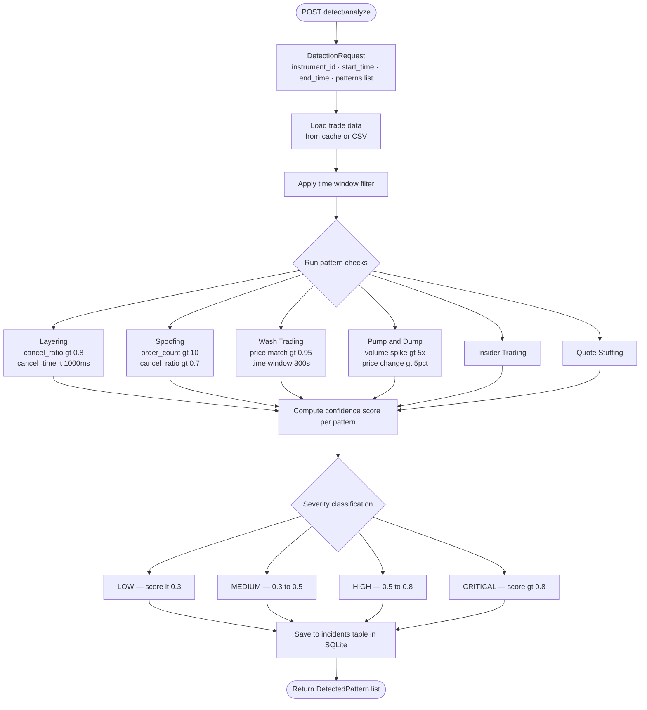
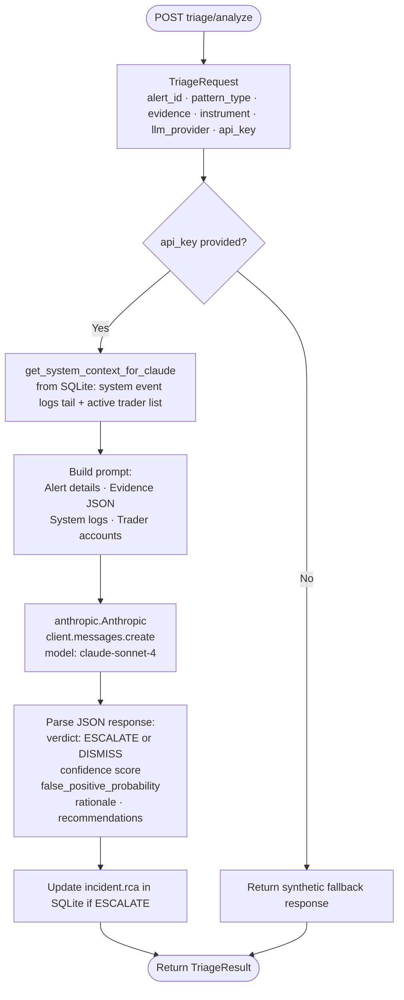
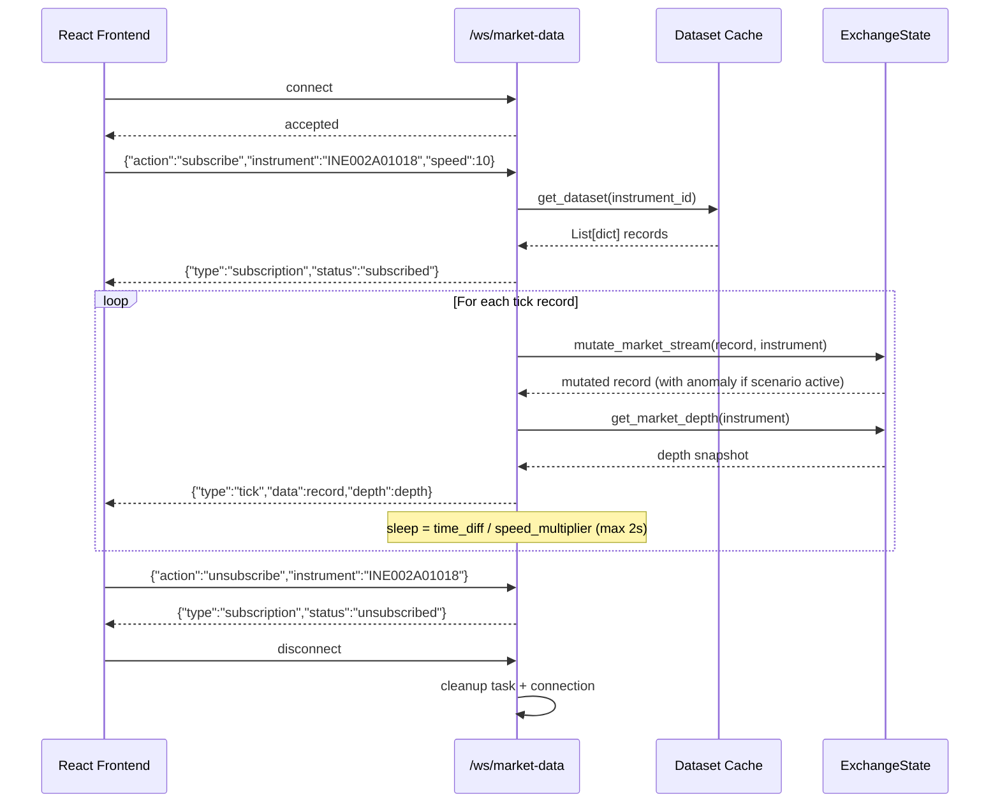
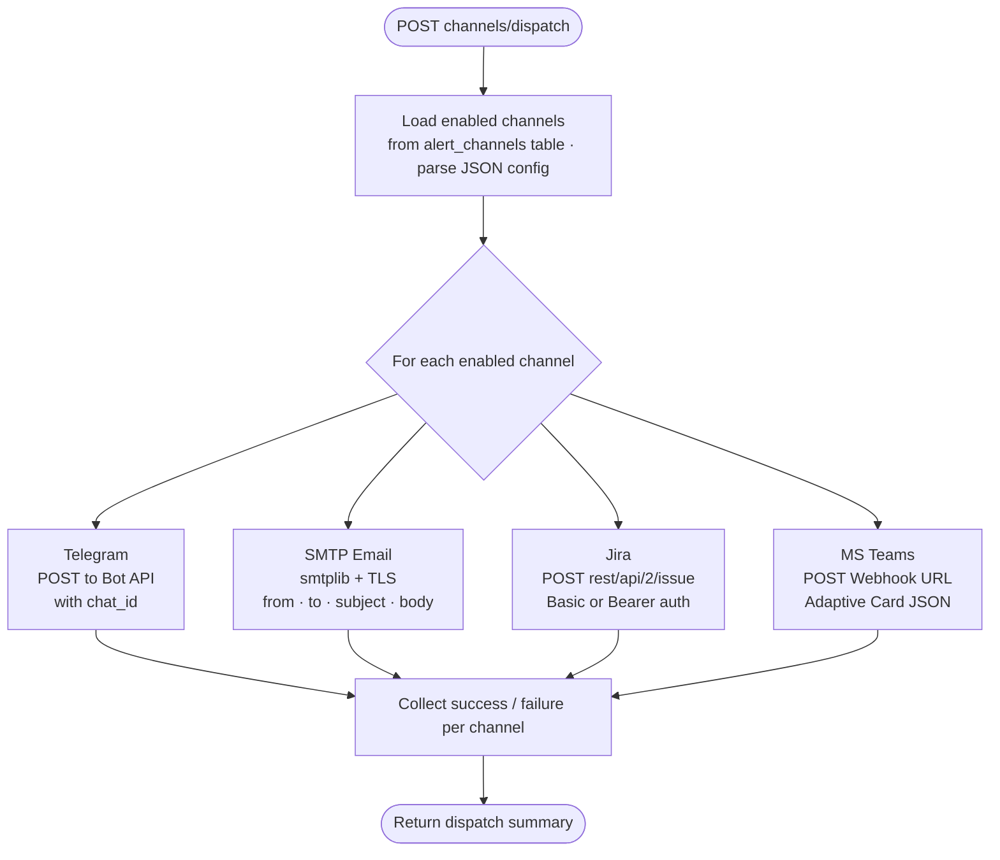
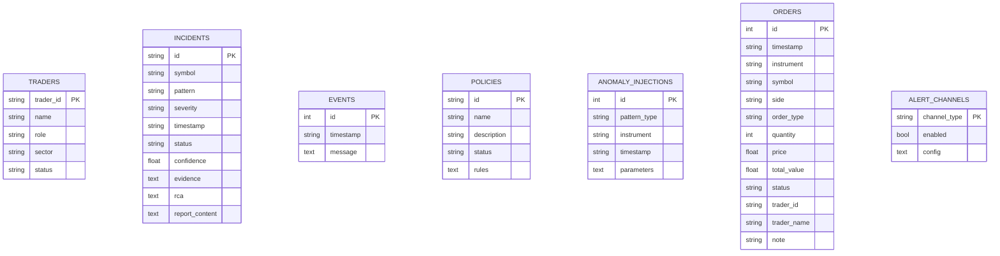

# Trade Threat Intelligence
> **AI-powered Trade Surveillance & Alert Triage Engine**
> Built for Wissen Technology Hackathon 2026

---

## Tech Stack

| Layer | Technologies |
|---|---|
| **Backend** | FastAPI · Python 3.9+ · SQLAlchemy · SQLite (dev) / PostgreSQL (prod) · Uvicorn · Pydantic |
| **AI / Triage** | Anthropic Claude API (claude-sonnet-4) |
| **Frontend** | React + TypeScript · Vite · TailwindCSS · Cytoscape.js · TradingView Lightweight Charts |
| **Alert Channels** | Telegram Bot API · SMTP · Jira REST API · Microsoft Teams Webhooks |
| **Datasets** | 7 Indian stock ISINs — RELIANCE, HDFCBANK, ICICIBANK, LT, TATAELXSI, HINDUNILVR, SUNPHARMA (raw tick-level CSV) |

---

## Table of Contents

1. [System Overview](#1-system-overview)
2. [High-Level Architecture](#2-high-level-architecture)
3. [Data Flow](#3-data-flow)
4. [Backend Module Breakdown](#4-backend-module-breakdown)
5. [API Endpoint Structure](#5-api-endpoint-structure)
6. [Pattern Detection Flow](#6-pattern-detection-flow)
7. [AI Triage Flow (Claude API)](#7-ai-triage-flow-claude-api)
8. [WebSocket Market Data Stream](#8-websocket-market-data-stream)
9. [Alert Channel Dispatch Flow](#9-alert-channel-dispatch-flow)
10. [Exchange State & Order Flow](#10-exchange-state--order-flow)
11. [Database Schema](#11-database-schema)
12. [Configuration Reference](#12-configuration-reference)

---

## 1. System Overview

The system monitors real-time trading activity, detects suspicious market manipulation patterns using rule-based and ML approaches, and uses **Anthropic Claude API** to triage alerts — reducing false positives for compliance teams. Genuine alerts are escalated through automated channels (Telegram, SMTP, Jira, Microsoft Teams).

**Core capabilities:**
- Real-time tick-level ingestion from 7 Indian equities
- Six manipulation pattern detectors (Layering, Spoofing, Wash Trading, Pump & Dump, Insider Trading, Quote Stuffing)
- Claude-powered AI triage with confidence scoring and RCA generation
- Multi-channel alert dispatch (Telegram, Email, Jira, MS Teams)
- WebSocket live market stream with exchange-state simulation

---

## 2. High-Level Architecture

---

## 3. Data Flow

---

## 4. Backend Module Breakdown

| Module | Responsibility |
|---|---|
| `main.py` | FastAPI app entrypoint, lifespan, WebSocket handler, CORS, routing |
| `config.py` | Settings via `pydantic_settings`, `.env` file loading |
| `db.py` | SQLite engine + ORM models (SQLAlchemy + raw sqlite3), `get_system_context_for_claude()` |
| `exchange_state.py` | `ExchangeState` singleton — `mutate_market_stream()`, `get_market_depth()`, `set_scenario()` |
| `trades.py` | Trade ingestion, trader history |
| `detection.py` | Pattern detection, Incident CRUD, Trader CRUD, Policy CRUD, Event log |
| `triage.py` | Claude API triage, RCA generation, report generation, investigation queries |
| `orders.py` | Place orders, order history, trigger scenarios, positions tracking |
| `channels.py` | Channel config CRUD, test connections, dispatch alerts (Telegram, SMTP, Jira, Teams) |

---

## 5. API Endpoint Structure

| Group | Endpoints |
|---|---|
| **Trades** | `POST /ingest` · `GET /stream` · `GET /{trader_id}` |
| **Detection** | `POST /analyze` · `GET /patterns` · `GET /alerts` · `GET\|POST /incidents` · `GET\|POST /traders` · `GET\|POST /policies` · `GET /events` |
| **Triage** | `POST /analyze` · `GET /{alert_id}` · `POST /batch` · `POST /rca` · `POST /report` · `POST /query` |
| **Orders** | `POST /place` · `GET /history` · `POST /trigger-scenario` · `GET /positions` |
| **Channels** | `GET /list` · `POST /configure` · `POST /test` · `POST /dispatch` |

---

## 6. Pattern Detection Flow

---

## 7. AI Triage Flow (Claude API)

---

## 8. WebSocket Market Data Stream

---

## 9. Alert Channel Dispatch Flow

---

## 10. Exchange State & Order Flow

```mermaid
flowchart TD
    subgraph ScenarioTrigger
        TrigReq([POST orders/trigger-scenario]) --> SetScenario[exchange_state.set_scenario\npattern_type + parameters]
        SetScenario --> Active[active_scenario stored\nin ExchangeState singleton]
    end

    subgraph OrderPlacement
        OrderReq([POST orders/place]) --> Validate[Validate OrderRequest]
        Validate --> InsertDB[INSERT into orders table SQLite]
        InsertDB --> AddBuffer[exchange_state.events_buffer append record]
        AddBuffer --> CheckPattern[Check buffer for pattern match]
        CheckPattern --> AlertCheck{Pattern detected?}
        AlertCheck -- Yes --> DedupCheck{In recent_alerts\nwithin 20s?}
        DedupCheck -- No --> SaveIncident[Save to incidents table]
        DedupCheck -- Yes --> Skip[Skip duplicate]
        AlertCheck -- No --> Done([Return order ID])
        SaveIncident --> Done
    end

    subgraph MarketMutation
        Tick[Incoming tick from CSV] --> MutateCheck{active_scenario set?}
        MutateCheck -- Yes --> ApplyPattern[Apply pattern:\nSpoofing: inflate depth\nLayering: add ghost orders\nWash: duplicate side\nPump-Dump: spike price]
        MutateCheck -- No --> PassThrough[Pass tick unchanged]
        ApplyPattern & PassThrough --> Out[Mutated tick to WebSocket]
    end
```

---

## 11. Database Schema

---

## 12. Configuration Reference

| Variable | Default | Description |
|---|---|---|
| `ANTHROPIC_API_KEY` | — | Required for Claude triage |
| `DATABASE_URL` | SQLite local | PostgreSQL URL for production |
| `LAYERING_CANCEL_RATIO_THRESHOLD` | `0.8` | Cancel ratio to flag layering |
| `LAYERING_CANCEL_TIME_THRESHOLD` | `1000` ms | Max time before cancel = suspicious |
| `SPOOFING_ORDER_COUNT_THRESHOLD` | `10` | Min orders for spoofing signal |
| `WASH_TRADING_MATCH_THRESHOLD` | `0.95` | Price match ratio for wash trades |
| `PUMP_DUMP_VOLUME_SPIKE_THRESHOLD` | `5.0x` | Volume spike multiplier |
| `HIGH_RISK_THRESHOLD` | `0.8` | Score above → HIGH risk |
| `REPLAY_SPEED_MULTIPLIER` | `10.0` | WebSocket stream speed |
| `WS_MAX_CONNECTIONS` | `100` | Max concurrent WebSocket clients |
| `JIRA_API_URL` | optional | Jira instance base URL |
| `SLACK_WEBHOOK_URL` | optional | Slack incoming webhook |
